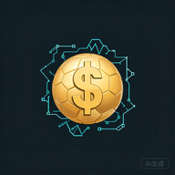

<div align="center">
  
  <h1>WC26-adr</h1>
  <p>WC26 世界杯预测 — Android App</p>
  <p>
    <a href="https://github.com/JTCAO515/WC26-adr/actions/workflows/build-apk.yml">
      
    </a>
    <a href="https://github.com/JTCAO515/WC26-adr/releases">
      
    </a>
  </p>
</div>

---

**WC26 Android** — 基于 worldcup.jtcao.space 的 PWA，使用 Google Trusted Web Activity 打包为原生 Android 应用。

## 📲 下载 APK

**方式一：最新自动构建（推荐）**

1. 打开 [Actions → Build APK → 最新一次成功运行](https://github.com/JTCAO515/WC26-adr/actions/workflows/build-apk.yml)
2. 往下滑到 **Artifacts** 区域
3. 点击 **WC26-APK** 下载 ZIP → 解压 → 安装 `app-release.apk`

**方式二：Release 版本**

前往 [Releases 页面](https://github.com/JTCAO515/WC26-adr/releases) 下载已发布的 APK。

## 🛠 自行构建

### 前置条件

- Android Studio (Hedgehog 2023.1+) 或命令行
- JDK 17+
- Android SDK 34+

### 构建 APK

```bash
git clone git@github.com:JTCAO515/WC26-adr.git
cd WC26-adr

# 生成发布版 APK
./gradlew assembleRelease

# APK 位置: app/build/outputs/apk/release/app-release.apk
```

## 📋 技术栈

| 项目 | 内容 |
|------|------|
| 框架 | Trusted Web Activity (TWA) |
| 目标 URL | https://worldcup.jtcao.space |
| 最低 SDK | 24 (Android 7.0) |
| 目标 SDK | 34 (Android 14) |
| 图标 | Seedream 5.0 生成(金色足球+$) |
| 签名 | 已内置密钥 |

## 📂 项目结构

```
WC26-adr/
├── .github/workflows/
│   └── build-apk.yml      # 自动编译 APK
├── app/
│   ├── build.gradle.kts
│   └── src/main/
│       ├── AndroidManifest.xml
│       └── res/            # 图标、主题、字符串
├── build.gradle.kts
├── settings.gradle.kts
├── gradle.properties
├── android.keystore        # 签名密钥
└── README.md
```

## 🔗 相关链接

- [WC26 预测平台](https://worldcup.jtcao.space)
- [WC26 主仓库](https://github.com/JTCAO515/26-WorldCup-Edge)
